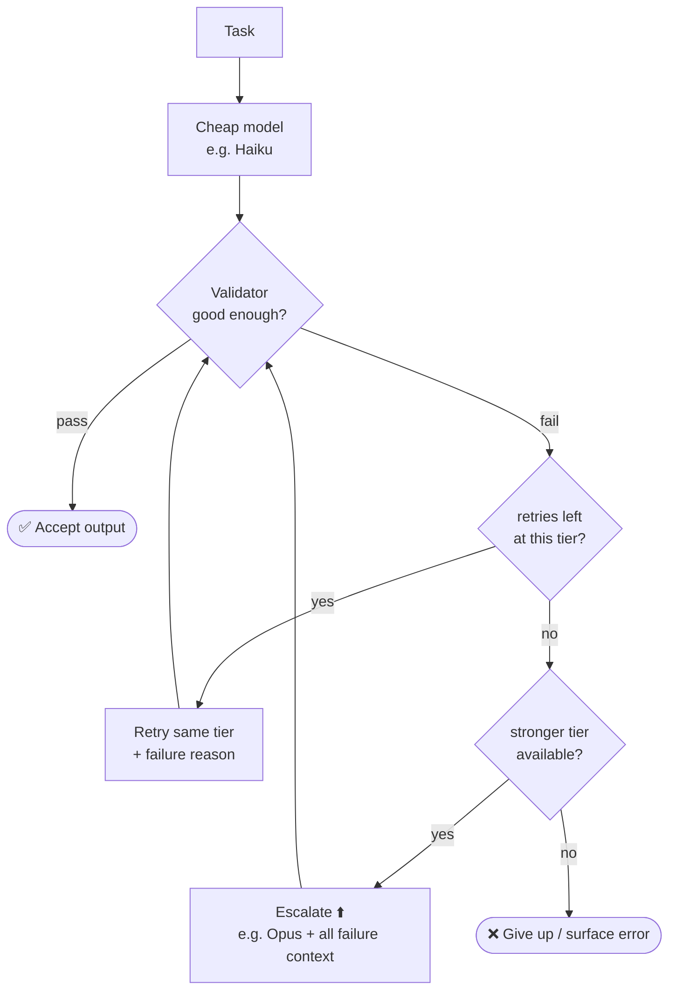

<div align="center">

# 🪜 model-escalation

### Cost-aware model escalation — *tiered agent fallback* as a Claude skill

Run the cheap model by default. Pay for the expensive one **only** when the cheap one genuinely can't do the job.

[](LICENSE)
[](SKILL.md)
[](scripts/escalating_agent.py)
[](https://github.com/anthropics/anthropic-sdk-python)
[](https://github.com/opelpleple/model-escalation/pulls)

</div>

---

A cheap model attempts the task. If it fails a configurable number of times, the work escalates to a more capable, more expensive model. Failure reasons from each attempt are fed forward, so the stronger model starts ahead instead of from scratch — and the cheap model often self-corrects on retry, so you never escalate at all.

> **Run Haiku by default. Only pay for Opus when Haiku genuinely can't do it.**

## 🤔 Why

Most agent cost is spent running a big model on tasks a small one could have handled. Escalation flips the default: small model first, big model only for the hard tail. The savings come from two things working together — a good **validator** (so you can tell when the small model failed) and a **feedback loop** (so escalation isn't starting from zero).

## 🔁 How it works



The loop is the easy part. **The validator is the product.**

## 📦 What's inside

```
model-escalation/
├── SKILL.md                       # the skill: pattern, algorithm, tuning
├── scripts/
│   └── escalating_agent.py        # runnable reference implementation (Anthropic SDK)
└── references/
    ├── validators.md              # the hard part: how to detect failure
    └── stack-variants.md          # Python / n8n / Claude Code sub-agents
```

## 🚀 Quick start

```bash
pip install anthropic pydantic
export ANTHROPIC_API_KEY=sk-ant-...
python scripts/escalating_agent.py
```

You'll see which tier each attempt used, whether it passed validation, and the token totals.

## 🧩 Use as a Claude skill

Drop the `model-escalation/` folder into your skills directory:

| Target | Location |
| --- | --- |
| Claude Code (global) | `~/.claude/skills/` |
| Claude Code (project) | `.claude/skills/` in your repo |
| Project skills folder | any `skills/` directory |

The skill triggers whenever you ask Claude to make an agent cheaper, add model fallback/escalation, route between cheap and expensive models, or build validators for LLM output.

## 💡 The two ideas that matter

| # | Idea | Why |
| --- | --- | --- |
| 1 | **The validator is 80% of the work** | Escalation is a trivial loop; reliably detecting a bad output is the hard part. See [`references/validators.md`](references/validators.md). |
| 2 | **Never escalate blind** | Feed each failure reason into the next attempt's prompt — otherwise you pay more and start over. |

## 📄 License

MIT — see [LICENSE](LICENSE).
